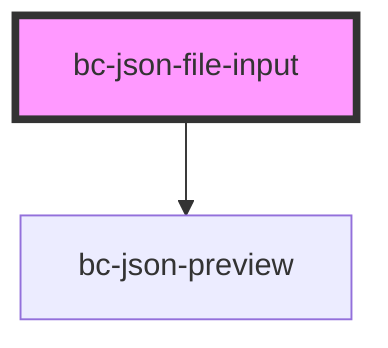

# bc-json-file-input

#### Example Usage

`npm install @bcodes/json-file-input --save`

```
<bc-json-file-input multiple preview-json>
    <!-- Any element can be used in place of a button -->
    <button>Upload Files</button>
</bc-json-file-input>
```

#### Button Styling

The *slotted* element (`<button>` in the example above) is outside of the Shadow DOM and can be styled externally

#### Global Css Variables

The following CSS variabels can be overriden globally

```css
:root {
    --bc-preview-background: #212020;
    --bc-preview-color: #40c64c;
    --bc-preview-font-family: sans-serif;
    --bc-preview-error: #791313
}
````

<!-- Auto Generated Below -->


## Properties

| Property          | Attribute      | Description | Type      | Default |
| ----------------- | -------------- | ----------- | --------- | ------- |
| `multiple`        | `multiple`     |             | `boolean` | `false` |
| `objectToConsole` | `console-log`  |             | `boolean` | `false` |
| `previewJson`     | `preview-json` |             | `boolean` | `false` |


## Events

| Event         | Description                                                | Type                                |
| ------------- | ---------------------------------------------------------- | ----------------------------------- |
| `filesLoaded` | Event emitted when files have been loaded                  | `CustomEvent<File[]>`               |
| `filesRead`   | Event emitted when files have been read (using FileReader) | `CustomEvent<readonly IFileData[]>` |


## Dependencies

### Depends on

- [bc-json-preview](../bc-json-preview)

### Graph


----------------------------------------------

*Built with [StencilJS](https://stenciljs.com/)*

# Stencil Docs

https://stenciljs.com/docs/decorators

## Using this component

### Script tag

- [Publish to NPM](https://docs.npmjs.com/getting-started/publishing-npm-packages)
- Put a script tag similar to this `<script src='https://unpkg.com/my-component@0.0.1/dist/mycomponent.js'></script>` in the head of your index.html
- Then you can use the element anywhere in your template, JSX, html etc

### Node Modules
- Run `npm install my-component --save`
- Put a script tag similar to this `<script src='node_modules/my-component/dist/mycomponent.js'></script>` in the head of your index.html
- Then you can use the element anywhere in your template, JSX, html etc

### In a stencil-starter app
- Run `npm install my-component --save`
- Add an import to the npm packages `import my-component;`
- Then you can use the element anywhere in your template, JSX, html etc

## npm

`npm publish --access=public`

## Unit Test Notes

- Create mocks using Jest support for `__mocks__` mocks folders at same level
   - see https://stenciljs.com/docs/mocking

Stencil's jest setup does not include jsdom. Stencil uses a slimmed down version of Puppeteer for unit tests - the window and document properties of which can be accessed via the page object returned from Stencil's newSpecPage()

As some of my tests are running without newSpecPage I needed to use the global object instead e.g. global.FileReader = createMockFileReader(files)
