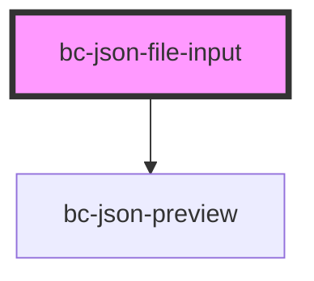

# bc-json-file-input

<!-- Auto Generated Below -->

## Properties

| Property          | Attribute      | Description | Type      | Default |
| ----------------- | -------------- | ----------- | --------- | ------- |
| `multiple`        | `multiple`     |             | `boolean` | `false` |
| `objectToConsole` | `console-log`  |             | `boolean` | `false` |
| `previewJson`     | `preview-json` |             | `boolean` | `false` |

## Events

| Event         | Description                                                | Type                          |
| ------------- | ---------------------------------------------------------- | ----------------------------- |
| `filesLoaded` | Event emitted when files have been loaded                  | `CustomEvent<File[]>`         |
| `filesRead`   | Event emitted when files have been read (using FileReader) | `CustomEvent<IPreviewData[]>` |

## Dependencies

### Depends on

- [bc-json-preview](../bc-json-preview)

### Graph

----------------------------------------------

*Built with [StencilJS](https://stenciljs.com/)*
