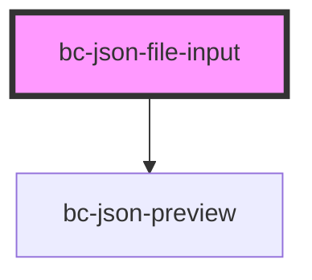

# bc-json-file-input

#### Example Usage

```
<bc-json-file-input multiple preview-json>
    <!-- Any element can be used in place of a button -->
    <button>Upload Files</button>
</bc-json-file-input>
```

#### Button Styling

The *slotted* element (`<button>` in the example above) is outside of the Shadow DOM and can be styled externally

#### Global Css Variables

The following CSS variabels can be overriden globally

```css
:root {
    --bc-preview-background: #212020;
    --bc-preview-color: #40c64c;
    --bc-preview-font-family: sans-serif;
}
````

<!-- Auto Generated Below -->


## Properties

| Property          | Attribute      | Description | Type      | Default |
| ----------------- | -------------- | ----------- | --------- | ------- |
| `multiple`        | `multiple`     |             | `boolean` | `false` |
| `objectToConsole` | `console-log`  |             | `boolean` | `false` |
| `previewJson`     | `preview-json` |             | `boolean` | `false` |


## Events

| Event         | Description                                                | Type                                |
| ------------- | ---------------------------------------------------------- | ----------------------------------- |
| `filesLoaded` | Event emitted when files have been loaded                  | `CustomEvent<File[]>`               |
| `filesRead`   | Event emitted when files have been read (using FileReader) | `CustomEvent<readonly IFileData[]>` |


## Dependencies

### Depends on

- [bc-json-preview](../bc-json-preview)

### Graph


----------------------------------------------

*Built with [StencilJS](https://stenciljs.com/)*
