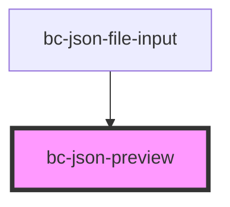

# bc-json-preview

<!-- Auto Generated Below -->

## Properties

| Property          | Attribute           | Description | Type                      | Default     |
| ----------------- | ------------------- | ----------- | ------------------------- | ----------- |
| `objectToConsole` | `object-to-console` |             | `boolean`                 | `false`     |
| `previewList`     | --                  |             | `readonly IPreviewData[]` | `undefined` |

## Dependencies

### Used by

 - [bc-json-file-input](../bc-json-file-input)

### Graph

----------------------------------------------

*Built with [StencilJS](https://stenciljs.com/)*
